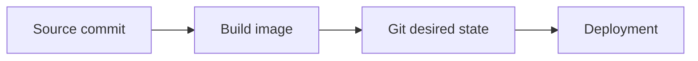

# Mermaid Diagram

Create diagrams that clarify the document's argument. Do not decorate it.

## 1. Select the message

Read the relevant document and identify its conclusion, mechanism, and reader decision points. Diagram only a relationship that prose alone makes materially harder to follow.

When the user asks to select content together, propose at most three candidates. For each, state:

- the reader question it answers;
- the recommended diagram type; and
- its intended placement.

Recommend the smallest useful set, normally one or two diagrams. Wait for selection when collaboration is requested; otherwise proceed with the strongest candidate.

Do not diagram facts already clear in one sentence, repeat nearby prose, or combine unrelated messages into one figure.

## 2. Choose the type

Match the relationship, not the visual novelty.

| Relationship to explain | Prefer |
| --- | --- |
| One-way process, responsibility handoff, or cause-and-effect path | `flowchart` |
| Ordered exchanges between actors or systems | `sequenceDiagram` |
| States and allowed transitions | `stateDiagram-v2` |
| Version or branch history | `gitGraph` |
| Static ownership or containment | `classDiagram` or a nested `flowchart` |
| A small before/after or option comparison | two small `flowchart` branches or a Markdown table |

Use a Markdown table when spatial relationships add little value.

## 3. Design for comprehension

- Give each diagram one sentence-worth of meaning and a nearby lead-in that says what to notice.
- Keep the main path to roughly five to seven nodes. Split a second independent message into another diagram.
- Use reader-facing labels: concrete nouns and short verbs. Preserve only identifiers needed to understand the contract or transition.
- Show normal flow left-to-right or top-to-bottom. Label edges only when the transition would otherwise be ambiguous.
- Use color, classes, icons, and subgraphs only when they encode a meaningful distinction. Do not rely on color alone.
- Keep error paths, implementation details, and exceptions out unless they are the point of the surrounding section.
- Represent examples as examples; never imply a generic rule from a single case.

## 4. Write and insert Mermaid

Use valid Mermaid syntax. Follow the host document's established wrapper. If none exists, use a fenced `mermaid` block; use a site-specific shortcode only when the host requires one.

Place the diagram immediately after the paragraph that introduces its message. Keep surrounding prose as the explanation; do not add a redundant caption.

## 5. Validate

- Confirm the Mermaid delimiters, node identifiers, arrows, and diagram type are syntactically consistent.
- Re-read at normal page width: the main path must be discoverable without reading every label.
- Confirm every shown relationship is supported by the document and that no sensitive or unnecessary operational detail was introduced.
- Run the host renderer or available preview/build check when one exists. Report renderer limitations separately from diagram design.
