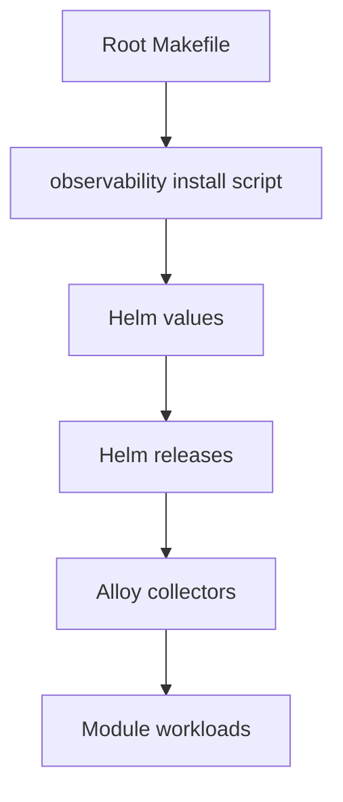
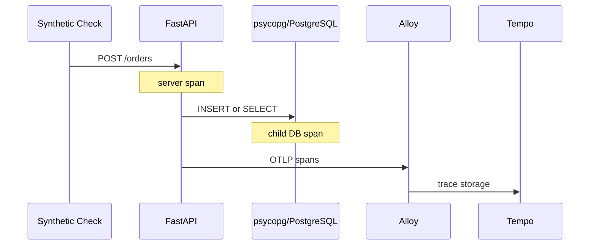

# 관측 스택 구현 구조

이 문서는 관측 스택을 변경·유지보수하는 개발자를 위한 구현 안내다. 설치·접속·Grafana 조회 방법은 [공유 관측 스택 README](../observability/README.md)에 있다.

## 구성 탐색 순서

아래는 저장소의 제어 진입점부터 telemetry를 보내는 workload까지의 소유 관계다. 실제 데이터는 반대 방향으로 이동한다.



| 순서 | 파일 | 확인할 것 | 다음 경계 |
| --- | --- | --- | --- |
| 1 | [`Makefile`](../Makefile) | `observability-up`, `observability-status`, `grafana` target과 기본 local port `3301` | 설치는 `observability/install.sh`로 간다. |
| 2 | [`observability/install.sh`](../observability/install.sh) | custom chart 없이 기존 chart 네 개를 version 고정해 설치함 | 각 release의 정책은 `values/`에 있다. |
| 3 | [`observability/values/`](../observability/values/) | Prometheus·Loki·Tempo·k8s-monitoring의 retention, datasource, destination | `k8s-monitoring` 값이 수집 workload를 정의한다. |
| 4 | [`k8s-monitoring.yaml`](../observability/values/k8s-monitoring.yaml) | `app`, `logs`, `events` Alloy Collector와 공용 OTLP receiver | Alloy Operator가 Collector 정의를 실제 workload로 조정한다. |
| 5 | [`order-api.yaml`](../labs/deployment-safety/schema-compatibility/k8s/base/order-api.yaml) | 모듈의 `OTEL_SERVICE_NAME`, 공용 OTLP gRPC endpoint | Pod가 trace를 `app` collector로 보낸다. |
| 6 | [`Dockerfile`](../labs/deployment-safety/schema-compatibility/Dockerfile), [`pyproject.toml`](../pyproject.toml) | `opentelemetry-instrument` wrapper와 FastAPI·psycopg instrumentation dependency | 앱 import 전에 자동 계측이 연결된다. |

## 각 경계의 책임

### 명령 경계

Root `Makefile`만 공용 stack lifecycle을 관리한다. Lab의 같은 target은 root Makefile에 맡긴다. 새 Lab도 Grafana·Loki·Tempo를 따로 설치하지 않는다.

`make grafana`는 Kubernetes Service를 local `3301`로 port-forward할 뿐이다. `GRAFANA_PORT`를 바꾸면 다른 local Grafana와 충돌하지 않는다.

### Helm 경계

`install.sh`는 다음 공개 chart의 release를 `opsproof-observability` namespace에 만든다.

| Release | Chart | 책임 |
| --- | --- | --- |
| `kube-prometheus` | `prometheus-community/kube-prometheus-stack` | Grafana와 Prometheus |
| `loki` | `grafana-community/loki` | logs와 events 저장 |
| `tempo` | `grafana-community/tempo` | traces 저장·trace 기반 metrics 생성 |
| `k8s-monitoring` | `grafana/k8s-monitoring` | Alloy Operator와 collector 정의 |

이 저장소는 chart source가 아니라 values와 release 연결을 관리한다. Chart version을 올리기 전에 해당 chart의 values schema와 `helm template` 결과를 확인한다.

### 저장 경계

- `kube-prometheus-stack.yaml`: Grafana datasource, Prometheus 7일 retention, 5Gi PVC
- `loki.yaml`: filesystem/PVC, 7일 retention, Compactor retention 활성화
- `tempo.yaml`: 3일 retention, span/service-graph metrics를 Prometheus remote-write receiver로 전송

Loki values는 Kubernetes manifest가 아니라 Helm values다. 파일 첫 줄의 JSON Schema는 editor가 `loki`, `singleBinary` 등 chart 키를 올바르게 검사하게 한다.

### 수집 경계

`k8s-monitoring`은 Helm release 하나지만 Pod 하나를 뜻하지 않는다. Chart가 Alloy Operator와 `app`·`logs`·`events` Collector 정의를 만들고, Operator가 Collector마다 적합한 Deployment 또는 DaemonSet을 만든다.

- `app`: Pod가 OTLP gRPC `:4317`로 보낸 trace 수신 → Tempo
- `logs`: 각 node의 Pod stdout/stderr 읽기 → Loki
- `events`: Kubernetes events 읽기 → Loki

관측 namespace는 logs/events 수집 대상에서 뺀다. collector가 자기 log를 다시 수집하는 순환을 막기 위해서다.

### 모듈 연결 경계

모듈은 새 Grafana나 Collector를 만들지 않는다. Kubernetes manifest에 고유한 `OTEL_SERVICE_NAME`과 아래 endpoint를 추가한다.

```text
http://k8s-monitoring-app.opsproof-observability.svc.cluster.local:4317
```

Pod stdout/stderr는 자동 수집된다. Trace는 OpenTelemetry SDK 또는 자동 계측을 명시적으로 켠 모듈만 전송한다.

### 애플리케이션 계측 경계

Schema Compatibility Lab의 컨테이너는 `opentelemetry-instrument`를 통해 Uvicorn을 실행한다. 이 wrapper가 FastAPI와 psycopg instrumentation을 app import 전에 활성화한다.



자동 계측은 지원 라이브러리의 HTTP·DB 경계만 span으로 만든다. 필요하면 application code에 manual span을 추가해 업무 단계를 기록한다. 이 Lab의 JSON log는 OTLP가 아니라 stdout → Alloy → Loki로 보낸다.

## 변경 전 확인

1. `helm template`으로 바꾼 chart values를 렌더링한다.
2. 새 모듈에는 고유한 `OTEL_SERVICE_NAME`을 부여한다.
3. 공용 stack에 새 저장소·수집기를 추가하기 전, 기존 signal로 해결할 수 없는지 확인한다.
4. `make observability-down`은 모든 모듈의 관측 데이터를 지우므로 공유 사용 여부를 확인한다.
