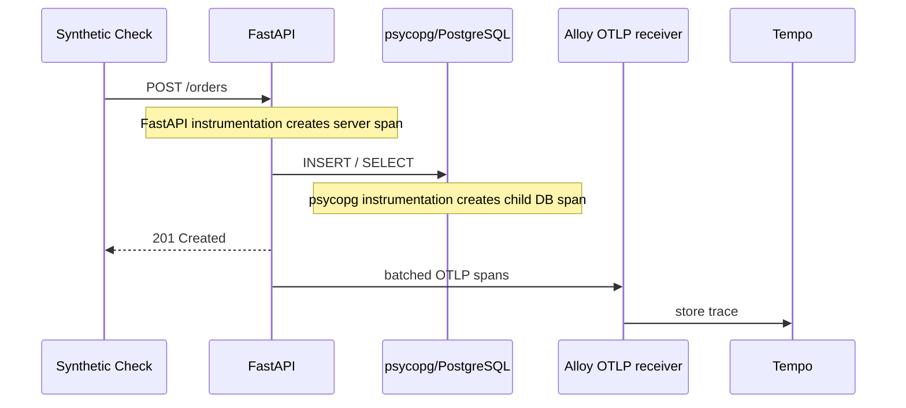

포트

# Shared Local Observability Stack

이 디렉터리는 특정 Lab이 소유하지 않는 `kind-opsproof` 클러스터용 관측 스택이다. 각 모듈은 Grafana를 새로 설치하지 않고 이 스택의 OTLP 수집기와 Grafana를 함께 쓴다.

metric·log·trace는 각 저장소에 보관한다. 사용자는 클러스터 밖 Browser에서 Grafana를 연다. 아래 그림에서 Grafana에서 나가는 화살표는 데이터 수집이 아니라 조회를 뜻한다.


[관측 용어집](GLOSSARY.md)은 관측·계측·telemetry·trace·span처럼 이 스택을 읽을 때 구분해야 할 용어를 설명한다.

모든 Helm release와 저장소는 `opsproof-observability` namespace 하나에 둔다. `k8s-monitoring`이 만든 Alloy collector는 여러 개일 수 있지만, Helm 관점에서는 release 하나다.

| Release             | 하는 일                                                     | 보관        |
| ------------------- | ----------------------------------------------------------- | ----------- |
| `kube-prometheus` | Prometheus, Grafana, Kubernetes metrics                     | metrics 7일 |
| `loki`            | 모든 모듈 Pod의 stdout logs, Kubernetes events              | logs 7일    |
| `tempo`           | OpenTelemetry traces, trace 기반 span/service-graph metrics | traces 3일  |
| `k8s-monitoring`  | Alloy 기반 log/event 수집, 공용 OTLP gRPC receiver          | 저장 안 함  |

`opsproof-observability`의 log·event는 수집하지 않는다. collector가 자신의 로그를 계속 쓰고 다시 읽는 순환을 막기 위해서다. `podLogsViaLoki.namespaces: []`는 나머지 모든 namespace를 뜻한다.

## 시작과 접속

```sh
make cluster-up
make observability-up
make observability-status
make grafana
```

그라파나 대시보드: `http://localhost:3301`

```sh
GRAFANA_PORT=3302 make grafana
```

Grafana의 로그인 Secret은 Helm이 namespace 안에 만든다. 사용자 이름은 `admin`이다. 비밀번호는 로컬에서만 아래 명령으로 확인한다. 값은 문서·Git에 복사하지 않는다. 외부 ingress는 만들지 않는다.

```sh
kubectl -n opsproof-observability get secret kube-prometheus-grafana \
  -o jsonpath='{.data.admin-password}' | base64 --decode
echo
```

## 다른 모듈 연결

Kubernetes에서 실행하는 모듈은 아래 OTLP endpoint를 공통으로 쓴다. 이 주소는 Pod 내부 주소이지 localhost가 아니다.

```yaml
env:
  - name: OTEL_SERVICE_NAME
    value: my-module-api
  - name: OTEL_EXPORTER_OTLP_PROTOCOL
    value: grpc
  - name: OTEL_EXPORTER_OTLP_ENDPOINT
    value: http://k8s-monitoring-app.opsproof-observability.svc.cluster.local:4317
```

stdout/stderr log는 코드를 바꾸지 않아도 Loki가 수집한다. 각 모듈은 trace를 보내려면 OpenTelemetry SDK 또는 자동 계측을 켜야 한다. `OTEL_SERVICE_NAME`은 Grafana에서 서비스를 구분하는 이름이므로 모듈마다 고정된 고유값을 정한다.

## Schema Compatibility Lab의 자동 계측

이미지는 다음 wrapper로 API 프로세스를 시작한다.

```text
opentelemetry-instrument uvicorn --factory opsproof.api:create_app ...
```

`opentelemetry-instrument`는 Uvicorn이 앱을 import하기 전에 설치된 instrumentation 패키지를 찾고 라이브러리에 hook을 건다. FastAPI는 들어온 HTTP 요청의 server span을 만들고, psycopg는 그 요청의 활성 trace 안에서 실행한 SQL의 child span을 만든다.



자동 계측은 지원하는 라이브러리 경계만 관찰한다. `validate_order` 같은 업무 단계를 보려면 코드에 manual span을 추가해야 한다. 이 구성에서 앱 log는 OTLP로 내보내지 않는다. JSON stdout → Alloy → Loki 경로를 사용한다.

## `k8s-monitoring` release의 의미

이 저장소는 custom Helm chart를 만들지 않는다. 설치기는 아래 기존 chart의 version을 고정하고, 이 저장소의 `values/`만 전달한다.

| Release             | 기존 chart                                            |
| ------------------- | ----------------------------------------------------- |
| `kube-prometheus` | `prometheus-community/kube-prometheus-stack` 88.3.0 |
| `loki`            | `grafana-community/loki` 18.9.1                     |
| `tempo`           | `grafana-community/tempo` 2.2.4                     |
| `k8s-monitoring`  | `grafana/k8s-monitoring` 4.4.0                      |

Helm release는 한 번의 설치·업데이트·삭제 단위다. `k8s-monitoring` chart는 dependency인 Alloy Operator와 `app`, `logs`, `events` Collector 정의를 만든다. Operator가 이를 Deployment·DaemonSet 등 실제 workload로 조정한다. release 하나가 Pod 하나를 뜻하지는 않지만, 업그레이드와 release history는 `k8s-monitoring` 하나로 관리한다.

Loki는 공식 Community chart의 `Monolithic` 모드와 chart 전용 JSON Schema를 사용한다. 이전 파일에서 보인 `Property … is not allowed`는 Kubernetes manifest schema가 Helm values를 검사할 때 생기는 편집기 경고였다. 이제 `loki.yaml`의 첫 줄이 Loki 18.9.1 schema를 명시하므로 `loki`, `singleBinary`, `read`, `write`, `backend`가 해당 chart의 유효한 키로 검사된다.

## 확인 순서

1. Grafana **Explore → Loki**: `{namespace="opsproof"}` 또는 다른 모듈 namespace로 logs를 찾는다.
2. **Explore → Tempo**: `service.name = opsproof-order-api` 같은 서비스 이름으로 traces를 찾는다.
3. Prometheus: `traces_spanmetrics_calls_total` 또는 `traces_service_graph_request_total`을 조회한다.
4. Pod 상태·Event·YAML은 별도 [Headlamp cluster UI](../cluster-ui/README.md)에서 빠르게 탐색한다.

이 구성은 단일 kind 클러스터에서만 쓴다. single replica, PVC 5Gi, short retention이며 HA·object storage·인증된 ingress·production 접근제어는 제공하지 않는다. Lab의 직접 판정 근거는 Synthetic Check Job이다. Grafana는 원인 탐색을 돕는다.

구현을 변경·유지보수하는 사람은 [관측 스택 구현 구조](../docs/observability-implementation.md)를 참고한다.

## 제거

```sh
make observability-down
```

이 명령은 공유 `opsproof-observability` namespace와 모든 모듈의 short-retention metrics, logs, traces를 삭제한다. 다른 모듈이 사용 중이면 실행하지 않는다. 실험 클러스터 자체를 지우는 `make cluster-down`도 같은 결과를 낸다.
